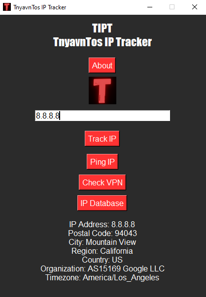

<h2 align=center>TIPT - TnyavnTos IP Tracker</h2>

<p align=center>TIPT can Track and Ping IP Addresses as well as check for VPN's or Proxies all in one compact and responsive UI.</p>

<br>

<h1 align=center><a href='https://github.com/Svxy/TIPT/releases/download/v1.2/TIPTv1.2.zip'>Download Now!</a></h1>

<br>

<p align=center></p>

<br>

<h3 align=center>Features:</h3>

<br>

<p align=center><sup>IP tracking using <a href='https://ipinfo.io' target='_blank'>ipinfo.io</a> json data</sup></p>

<p align=center><sup>IP pinging using responses from <a href='https://isitdownrightnow.com' target='_blank'>isitdownrightnow.com</a></sup></p>

<p align=center><sup>VPN/Proxy checking using <a href='https://ipinfo.io' target='_blank'>ipinfo.io</a> json data</sup></p>

<br>

<h3 align=center>Source Code<br>Installation/Compilation:</h3>

<br>

<p align=center>Installation</p>

```shell
git clone https://github.com/Svxy/TIPT.git
```

```shell
cd TIPT
```

```shell
pip install -r requirements.txt
```

<br>

<p align=center>Compilation</p>

```shell
pip install auto-py-to-exe
```

```shell
auto-py-to-exe OR python -m auto_py_to_exe
```

Once Auto Py To Exe is opened select the file, choose OneFile and Window Based, add the included icon.

Then in Advanced set the name to whatever you like, and turn on --ascii and --clean.

<br>

<h4 align=center>Have fun!</h4>

<br>

<p align=center>This project released under the <a href='./LICENSE'>Apache License</a>.</p>